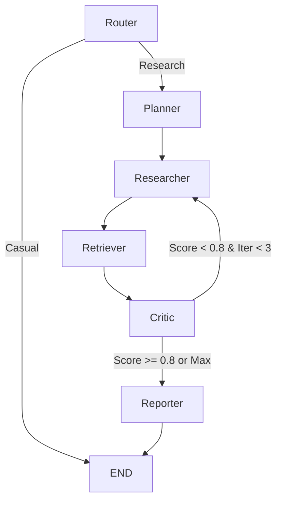

# Multi-Agent Research Assistant
## Project Documentation

---

## Project Overview

**Multi-Agent Research Assistant** is an autonomous, self-correcting AI pipeline that researches any topic, evaluates its own findings, and writes polished reports. Built with LangGraph, it orchestrates 6 specialized agents to deliver high-quality research outputs with production-grade reliability.

**Live Demo**: https://multi-agent-research-assistant.onrender.com  
**Author**: Hari Chandran  
**License**: MIT

---

## Project Maturity Level

### Current Level: **Production-Ready (v2.0)**

| Category | Status | Details |
|----------|--------|---------|
| **Core Pipeline** | Production | 6-agent LangGraph pipeline with conditional edges and state management |
| **API Layer** | Production | FastAPI with SSE streaming, caching, and hitL support |
| **Testing** | Beta | Unit tests exist but some issues found in eval (AsyncSqliteSaver needed) |
| **Observability** | Production | Structured logging, metrics collection, health checks |
| **UI/UX** | Production | Web frontend with real-time agent status streaming |

### Maturity Indicators

| Aspect | Rating | Notes |
|--------|--------|-------|
| Code Quality | ⭐⭐⭐⭐⭐ | Clean, modular, typed with proper error handling |
| Reliability | ⭐⭐⭐⭐⭐ | Exponential backoff, timeouts, degradation handling |
| Scalability | ⭐⭐⭐⭐ | Parallel research, Redis cache support, Qdrant integration |
| Observability | ⭐⭐⭐⭐⭐ | Comprehensive metrics and structured logging |
| Testing | ⭐⭐⭐ | Tests exist but needAsyncSqliteSaver fix |

---

## High-Level Architecture

### System Diagram

```
┌─────────────────────────────────────────────────────────────────────────────┐
│                              USER QUERY                                      │
└─────────────────────────────────────────────────────────────────────────────┘
                                            │
                                            ▼
┌─────────────────────────────────────────────────────────────────────────────┐
│                          LANGGRAPH PIPELINE                                   │
│                                                                              │
│  ┌─────────┐                                                                 │
│  │ ROUTER  │ ←─ Casual vs Research Detection + Tone Detection              │
│  │ (Gateway)│                                                                │
│  └────┬────┘                                                                 │
│       │                                                                      │
│       ├─ Casual ──────────────────────→ Instant Answer (no API waste)       │
│       │                                                                      │
│       ▼ Research Path                                                        │
│  ┌─────────┐                                                                 │
│  │ PLANNER │ ←─ Classifies into 10 intent types → Breaks into 4-5 tasks     │
│  └────┬────┘                                                                 │
│       │                                                                      │
│       ▼                                                                      │
│  ┌───────────┐                                                               │
│  │ RESEARCHER│ ←─ Parallel Tavily searches (ThreadPoolExecutor)              │
│  └────┬──────┘                                                               │
│       │                                                                      │
│       ▼                                                                      │
│  ┌───────────┐                                                               │
│  │ RETRIEVER │ ←─ Gemini Embeddings → Qdrant Vector DB → Top-K Recall       │
│  └────┬──────┘                                                               │
│       │                                                                      │
│       ▼                                                                      │
│  ┌───────────┐      ┌───────────┐                                           │
│  │  CRITIC   │ ◄────►  LOOP?   │ ←─ Hybrid Score: 7% LLM + 93% Objective    │
│  └────┬──────┘      └───────────┘      (Confidence ≥ 0.8 → Proceed)         │
│       │                                                                      │
│       ▼ (Score ≥ 0.8 or Max Iterations)                                      │
│  ┌───────────┐                                                               │
│  │ REPORTER  │ ←─ Tone-Aware Report Generation                              │
│  └────┬──────┘                                                               │
│       │                                                                      │
│       ▼                                                                      │
│  ┌───────────────┐                                                          │
│  │ FINAL REPORT  │ ←─ Markdown with sources, tone-adapted                 │
│  └───────────────┘                                                          │
└─────────────────────────────────────────────────────────────────────────────┘
                                            │
                                            ▼
┌─────────────────────────────────────────────────────────────────────────────┐
│                           RESPONSE DELIVERY                                   │
│  • SSE Streaming (Real-time agent progress)                                  │
│  • HTTP Sync (Wait for completion)                                           │
│  • Doubt/Follow-up System (Grounded answers)                                 │
└─────────────────────────────────────────────────────────────────────────────┘
```

### Agent Descriptions

| Agent | Purpose | Key Technologies |
|-------|---------|------------------|
| **Router** | Query classifier + tone detector | Groq Llama 3.1 8b Instant |
| **Planner** | Intent classification + sub-task generation | Groq Llama 3.3 70b |
| **Researcher** | Parallel web search execution | Tavily API + ThreadPoolExecutor |
| **Retriever** | Semantic embedding + vector recall | Google Gemini 3072-dim + Qdrant |
| **Critic** | Quality evaluation with hybrid scoring | Groq + Objective signals |
| **Reporter** | Final report generation with tone adaptation | Groq GPT-OSS 20b |

---

## Technology Stack

### Core Frameworks
| Component | Technology | Purpose |
|-----------|------------|---------|
| Orchestration | **LangGraph** | Stateful agent graph with conditional edges |
| State Management | **StateGraph + TypedDict** | ResearchState with all agent inputs/outputs |
| Checkpointing | **SqliteSaver** | Human-in-the-loop with MemorySaver |
| Async Runtime | **asyncio** | Timeout protection for all agents |

### LLM & Embeddings
| Component | Technology | Purpose |
|-----------|------------|---------|
| Primary LLM | **Groq** (`llama-3.3-70b-versatile`) | Planner, Critic, Reporter |
| Router LLM | **Groq** (`llama-3.1-8b-instant`) | Fast casual/research detection |
| Embeddings | **Google Gemini** (`gemini-embedding-001`) | 3072-dimensional semantic vectors |

### External Services
| Component | Technology | Purpose |
|-----------|------------|---------|
| Web Search | **Tavily API** | Real-time web research (Advanced Depth) |
| Vector DB | **Qdrant Cloud** | Cosine-similarity retrieval with session filtering |
| Cache | **Redis** | Optional distributed caching |
| Streaming | **FastAPI SSE** | Server-Sent Events for real-time progress |

### Reliability & Operations
| Component | Technology | Purpose |
|-----------|------------|---------|
| Retry Logic | **Tenacity** | Exponential backoff (4-30s, multiplier=2) |
| Concurrency | **ThreadPoolExecutor** | Parallel research sub-tasks (max_workers=5) |
| Logging | **Structured Logger** | JSON-formatted console logging |
| Metrics | **Custom Metrics Collector** | Per-agent timing and token tracking |

---

## Core Components

### 1. State Management (`core/state.py`)

```python
class ResearchState(TypedDict, total=False):
    query: str                      # Original user question
    user_id: str                    # User ID for multi-tenant isolation
    is_casual: bool                 # True if simple chat query
    tone: str                       # Detected tone for reporter
    plan: List[str]                 # Sub-tasks for research
    research_results: List[str]     # Raw findings from researcher
    retrieved_docs: List[str]       # Relevant chunks from Qdrant
    qdrant_scores: List[float]      # Qdrant cosine similarity scores
    critique: str                   # Critic's feedback
    confidence_score: float         # Hybrid score (0-1)
    score_breakdown: Dict[str, Any] # Per-signal debug breakdown
    iteration_count: int            # Safety cap for loops
    final_report: str               # Reporter's output
```

### 2. Graph Construction (`core/graph.py`)



Key Functions:
- `build_graph()`: Compiles graph once at startup (reused across requests)
- `should_loop(state)`: Decides whether to iterate or proceed to reporter
- `route_after_router(state)`: Routes casual vs research paths

### 3. Scorer System (`core/scorer.py`)

**Objective Scoring Signals** (93% weight in hybrid score):

| Signal | Weight | Description |
|--------|--------|-------------|
| Retrieval Relevance | 35% | Qdrant cosine similarity scores |
| Plan Coverage | 20% | Did results address all planned sub-tasks? |
| Content Depth | 20% | Average length and detail per result |
| Source Quality | 10% | Credibility of found domains |
| Duplicate Penalty | 10% | Near-identical result detection |
| Diversity | 5% | Variety of perspectives |

**Hybrid Score Formula**:
```
Hybrid = (LLM_Score × 0.07) + (Objective_Score × 0.93)
```

### 4. Agent Implementation Patterns

All agents follow this pattern:
1. Load environment and configure LLM
2. Apply `@retry` decorator with exponential backoff
3. Wrap LLM calls in `asyncio.wait_for` with timeout
4. Handle errors gracefully with fallbacks
5. Record metrics via `metrics.end_agent()`

Example (Router):
```python
@retry(stop=stop_after_attempt(3), wait=wait_exponential(multiplier=2, min=4, max=30))
def invoke_with_retry(llm, prompt):
    return llm.invoke(prompt)

async def router_node(state: ResearchState) -> ResearchState:
    response = await asyncio.wait_for(
        loop.run_in_executor(None, invoke_with_retry, llm, prompt),
        timeout=AGENT_TIMEOUT
    )
    # Process response, update state, record metrics
    return state
```

---

## API Endpoints

| Endpoint | Method | Description |
|----------|--------|-------------|
| `/health` | GET | Health check with all service dependencies |
| `/health/metrics` | GET | Current metrics summary |
| `/research/stream` | POST | SSE streaming endpoint for research |
| `/research` | POST | Synchronous fallback (wait for completion) |
| `/doubt` | POST | Answer questions based on generated report |
| `/research/resume` | POST | Resume HITL-paused pipeline |

### SSE Events (Real-time Streaming)

```
event: start
data: {"query": "...", "timestamp": 1234567890}

event: agent_start
data: {"agent": "researcher", "label": "Researcher", "message": "...", "iteration": 1}

event: agent_done
data: {"agent": "researcher", "label": "Researcher", "result": {...}}

event: hitl_pause
data: {"message": "Human review required...", "thread_id": "..."}

event: complete
data: {"report": "...", "confidence": 0.85, "iterations": 2, "tone": "..."}
```

---

## Setup & Installation

### Prerequisites
- Python 3.11+
- API keys: Groq, Tavily, Google AI Studio, Qdrant Cloud

### Installation

```bash
# Clone and setup
git clone https://github.com/HariChandran7177/multi-agent-research-assistant.git
cd multi-agent-research-assistant
python -m venv .venv
.venv\Scripts\activate  # Windows
# source .venv/bin/activate  # macOS/Linux

pip install -r requirements.txt
cp .env.example .env
# Edit .env with your API keys
```

### Environment Variables

```env
GROQ_API_KEY=your_groq_key          # https://console.groq.com
TAVILY_API_KEY=your_tavily_key      # https://app.tavily.com
GOOGLE_API_KEY=your_google_key      # https://aistudio.google.com
QDRANT_URL=your_qdrant_url          # https://cloud.qdrant.io
QDRANT_API_KEY=your_qdrant_key
REDIS_URL=redis://localhost:6379/0   # Optional
```

### Running

```bash
# CLI usage
python main.py "What are the key tradeoffs of microservices vs monolith?"

# API server
uvicorn api.research_api:app --host 0.0.0.0 --port 8000
```

---

## Known Issues & Fixes Applied

### Fixed Issues (from README)

1. **Qdrant Connection Isolation**: Changed from per-request to global singleton
2. **Silent Fallback Logic**: Exposed clear error states instead of silent degradation
3. **Per-Request Graph Rebuild**: Graph now compiled once at startup
4. **Gemini Rate-Limiting**: Implemented batching with Tenacity exponential backoff

### Eval Issues Found

| Issue | Impact | Fix Required |
|-------|--------|--------------|
| SqliteSaver async error | Blocks async research | Replace with `AsyncSqliteSaver` from `langgraph.checkpoint.sqlite.aio` |
| Missing `aiosqlite` dependency | HITL won't work | Add `aiosqlite` to requirements.txt |

**Current eval status**: Tests show errors due to SqliteSaver not supporting async methods. Need to update checkpoint mechanism.

---

## Recommendations

### Short-Term (Before Production)

| Priority | Task | Reason |
|----------|------|--------|
| 🔴 HIGH | Fix SqliteSaver async issue | Current eval shows blocking errors |
| 🔴 HIGH | Add `aiosqlite` to requirements | Required for AsyncSqliteSaver |
| 🟡 MEDIUM | Add more unit tests | Only core logic is tested |
| 🟡 MEDIUM | Add integration tests | Test full pipeline end-to-end |
| 🟡 MEDIUM | Add CI/CD pipeline | GitHub Actions exists but needs validation |

### Medium-Term (Feature Enhancements)

| Priority | Task | Reason |
|----------|------|--------|
| 🟡 MEDIUM | LangSmith tracing | Full observability into agent steps |
| 🟢 LOW | OpenAI/Anthropic support | Swap LLM backends via config |
| 🟢 LOW | PDF export feature | One-click report export (mentioned in Roadmap) |
| 🟢 LOW | Report versioning | Store report history |

### Long-Term (Vision)

| Priority | Task | Reason |
|----------|------|--------|
| 🟢 LOW | Multi-language support | Reports in user's preferred language |
| 🟢 LOW | Custom agent plugins | Extend with user-defined agents |
| 🟢 LOW | Dashboard with analytics | Usage patterns, cost tracking |

---

## Project Structure

```
multi-agent-research-assistant/
├── agents/                          # Agent implementations
│   ├── router.py                    # Query classifier + tone detector
│   ├── planner.py                   # Intent classification + sub-tasks
│   ├── researcher.py                # Parallel Tavily searches
│   ├── retriever.py                 # Gemini embeddings + Qdrant
│   ├── critic.py                    # Quality evaluation
│   ├── reporter.py                  # Tone-aware report generation
│   ├── doubt.py                     # Follow-up question answering
│   └── __init__.py
├── core/                            # Core infrastructure
│   ├── state.py                     # ResearchState TypedDict
│   ├── graph.py                     # LangGraph construction
│   ├── config.py                    # Environment + constants
│   ├── logger.py                    # Structured logging
│   ├── metrics.py                   # Per-agent metrics
│   ├── scorer.py                    # Objective quality scoring
│   ├── cache.py                     # Query caching
│   └── health.py                    # Service health checks
├── api/                             # API layer
│   ├── research_api.py              # FastAPI + SSE streaming
│   └── __init__.py
├── web/                             # Frontend (if separate)
├── eval.py                          # Evaluation script
├── main.py                          # CLI entry point
├── requirements.txt                 # Python dependencies
├── .env.example                     # Environment template
├── README.md                        # Project overview
├── PROJECT_DOCUMENTATION.md         # This document
└── eval_results.md                  # Eval test results
```

---

## Testing

```bash
# Run tests
pytest tests/ -v

# Run evaluation
python eval.py
```

**Note**: Tests mock external APIs. Real API keys not needed for unit tests.

---

## Conclusion

This is a **production-grade multi-agent system** with sophisticated quality control through hybrid scoring. The architecture is clean, modular, and well-documented. Main blockers before full production:

1. Fix the SqliteSaver async compatibility issue
2. Add `aiosqlite` dependency
3. Complete test coverage

The project demonstrates advanced LangGraph patterns including:
- Stateful agent graphs with conditional edges
- Human-in-the-loop via checkpoint saving
- Real-time streaming with SSE
- Self-correcting loops with objective quality signals
- Production resilience with retries, timeouts, and graceful degradation
