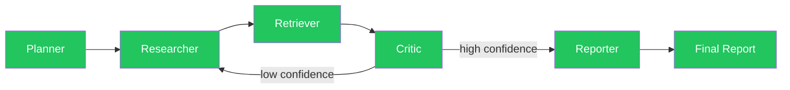

# 🔬 Multi-Agent Research Assistant

An AI-powered research assistant that orchestrates **5 specialized agents** to plan, search, retrieve, critique, and synthesize research reports from a single natural-language query — built with **LangGraph**.

## Overview

Ask a question, and the system automatically:
1. **Plans** — breaks your query into focused sub-tasks
2. **Researches** — searches the web for each sub-task
3. **Retrieves** — embeds findings and pulls the most relevant context via semantic search
4. **Critiques** — scores research quality and decides whether more research is needed
5. **Reports** — synthesizes everything into a structured, readable report

If the Critic isn't confident in the research quality, the graph loops back to the Researcher automatically (capped at 3 iterations) before finalizing a report.

## Architecture



## Tech Stack

| Layer | Technology |
|---|---|
| Orchestration | LangGraph + LangChain |
| LLM | Groq (`llama-3.3-70b-versatile`) |
| Web Search | Tavily API |
| Embeddings | Google Gemini (`gemini-embedding-001`, 3072-dim) |
| Vector DB | Qdrant Cloud |
| Language | Python 3.11+ |

## Project Structure
├── agents/          # Individual agent nodes (Planner, Researcher, Retriever, Critic, Reporter)
├── core/            # Shared state definition + LangGraph workflow wiring
├── api/             # FastAPI endpoints (in progress)
├── frontend/         # UI (planned)
├── tests/           # Unit tests (in progress)
├── main.py          # CLI entry point
└── requirements.txt

## Setup

1. Clone the repo and create a virtual environment:
```bash
   git clone <your-repo-url>
   cd multi-agent-research-assistant
   python -m venv venv
   venv\Scripts\activate          # Windows
```

2. Install dependencies:
```bash
   pip install -r requirements.txt
```

3. Copy `.env.example` to `.env` and add your API keys:
GROQ_API_KEY=
TAVILY_API_KEY=
GOOGLE_API_KEY=
QDRANT_URL=
QDRANT_API_KEY=
   All four services offer free tiers sufficient for development and testing.

4. Run the pipeline:
```bash
   python -m core.graph
```

## Current Status

- ✅ All 5 agents implemented and working end-to-end
- ✅ Conditional loop (Critic → Researcher) working with iteration cap
- 🔲 CLI entry point (`main.py`) — in progress
- 🔲 Error handling with retries
- 🔲 Logging
- 🔲 Unit tests
- 🔲 FastAPI endpoints + frontend

## Sample Output

> **Query:** "What are the latest advancements in quantum computing?"
>
> See [`sample_outputs/`](./sample_outputs) for a full example report generated by the pipeline.