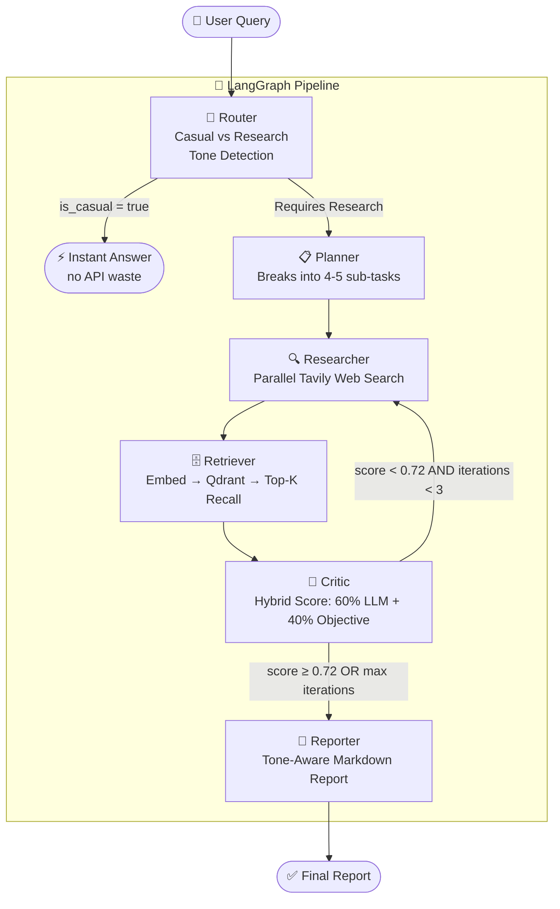

<div align="center">

  

  <br/>

  <h1>🤖 Multi-Agent Research Assistant</h1>

  <p><strong>An autonomous, self-correcting AI pipeline that researches any topic, evaluates its own findings, and writes polished reports — powered by LangGraph.</strong></p>

  <br/>

  <!-- Badges -->
  
  
  
  
  
  

  <br/><br/>

  [**📖 How It Works**](#️-architecture--workflow) · [**🚀 Quickstart**](#-quickstart) · [**💡 Features**](#-features) · [**📄 Sample Output**](#-sample-output) · [**🤝 Contributing**](CONTRIBUTING.md)

</div>

---

## 💡 Features

<table>
  <tr>
    <td>🔀 <strong>Smart Router</strong></td>
    <td>Intercepts casual queries (e.g., "Hello!") and answers instantly — no wasted API calls. Detects the desired response tone from your query.</td>
  </tr>
  <tr>
    <td>📋 <strong>Intelligent Planner</strong></td>
    <td>Classifies your query into 10 research intent types and breaks it into 4–5 targeted sub-tasks for maximum coverage.</td>
  </tr>
  <tr>
    <td>⚡ <strong>Parallel Research</strong></td>
    <td>Fires concurrent Tavily web searches using <code>ThreadPoolExecutor</code>. Cuts research time from ~60s to under 10s.</td>
  </tr>
  <tr>
    <td>🧠 <strong>Semantic RAG</strong></td>
    <td>Embeds all results with Google Gemini (3072-dim) and retrieves only the most relevant chunks via Qdrant — no bloated prompts.</td>
  </tr>
  <tr>
    <td>🔁 <strong>Self-Correcting Loop</strong></td>
    <td>A Critic agent scores research quality using a <strong>hybrid score</strong> (60% LLM + 40% objective signals). If confidence is low, it loops back for another research pass — automatically.</td>
  </tr>
  <tr>
    <td>🎭 <strong>Dynamic Tone</strong></td>
    <td>Write "explain like I'm 5" or "be super formal" — the Reporter picks it up from your query and adapts the entire final report.</td>
  </tr>
  <tr>
    <td>🛡️ <strong>Production-Grade Reliability</strong></td>
    <td>Exponential-backoff retries on all LLM/API calls. Qdrant auto-falls back to in-memory if the cloud instance is unreachable.</td>
  </tr>
</table>

---

## 🏗️ Architecture & Workflow


```mermaid
flowchart TD
    A([🧑 User Query]) --> B

    subgraph Pipeline ["🔄 LangGraph Pipeline"]
        B[🔀 Router\nCasual vs Research\nTone Detection]
        B -- is_casual = true --> Z1([⚡ Instant Answer\nno API waste])
        B -- Requires Research --> C[📋 Planner\nBreaks into 4-5 sub-tasks]
        C --> D[🔍 Researcher\nParallel Tavily Web Search]
        D --> E[🗄️ Retriever\nEmbed → Qdrant → Top-K Recall]
        E --> F[🧐 Critic\nHybrid Score: 60% LLM + 40% Objective]
        F -- score < 0.72 AND iterations < 3 --> D
        F -- score ≥ 0.72 OR max iterations --> G[📝 Reporter\nTone-Aware Markdown Report]
    end

    G --> Z2([✅ Final Report])
```

---

## 🛠️ Tech Stack

| Layer | Technology | Purpose |
|---|---|---|
| **Orchestration** | [LangGraph](https://github.com/langchain-ai/langgraph) | Stateful agent graph with conditional edges |
| **LLM Engine** | [Groq](https://groq.com) · `llama-3.3-70b-versatile` | Fast inference for Planner, Critic, Reporter |
| **Router LLM** | [Groq](https://groq.com) · `llama-3.1-8b-instant` | Lightweight, fast routing decisions |
| **Web Search** | [Tavily API](https://tavily.com) (Advanced Depth) | Real-time web research |
| **Embeddings** | [Google Gemini](https://ai.google.dev) · `gemini-embedding-001` | 3072-dimensional semantic vectors |
| **Vector Database** | [Qdrant Cloud](https://qdrant.tech) | Cosine-similarity retrieval with session filtering |
| **Retry Logic** | [Tenacity](https://tenacity.readthedocs.io) | Exponential backoff on all external calls |
| **Concurrency** | Python `ThreadPoolExecutor` | Parallel research sub-tasks |

---

## 📄 Sample Output

<details>
<summary><strong>🖥️ Click to expand — "AWS vs GCP for Startups in 2025?"</strong></summary>

> **Query:** `"Should a startup build on AWS vs GCP in 2025? Explain the tradeoffs like a senior engineer would."`
> **Tone detected:** `professional and technical` | **Iterations:** 2 | **Confidence:** `0.84`

---

### AWS vs GCP for Startups in 2025: A Senior Engineer's Breakdown

The honest answer? **It depends on your workload** — but the decision is far less symmetric than AWS's market dominance implies.

| Criteria | AWS | GCP |
|---|---|---|
| Market share | ✅ 31% dominant | ❌ 12% |
| ML/AI native tooling | SageMaker (verbose) | ✅ Vertex AI + TPUs |
| Managed Kubernetes | EKS (complex) | ✅ GKE (superior) |
| Data warehouse | Redshift | ✅ BigQuery (serverless) |
| Startup credits | $5K–$100K | $200K |
| Networking cost | Expensive egress | ✅ Cheaper |

**Choose AWS** → General SaaS, compliance-heavy industries, large hiring pool.
**Choose GCP** → ML-core products, data pipelines, Kubernetes-heavy architectures.

> *The senior engineer's take: AWS is the safe default. GCP is the smart choice if data or ML is core to your product.*

📄 [Read the full report →](sample_outputs/aws_vs_gcp_report.md)

</details>

---

## 🚀 Quickstart

### Prerequisites
- Python 3.11+
- Free API accounts (all have generous free tiers):
  - [Groq](https://console.groq.com) — LLM inference
  - [Tavily](https://app.tavily.com) — Web search
  - [Google AI Studio](https://aistudio.google.com) — Embeddings
  - [Qdrant Cloud](https://cloud.qdrant.io) — Vector database (or runs in-memory)

### Installation

```bash
# 1. Clone the repo
git clone https://github.com/HariChandran7177/multi-agent-research-assistant.git
cd multi-agent-research-assistant

# 2. Create a virtual environment
python -m venv .venv
.venv\Scripts\activate          # Windows
# source .venv/bin/activate     # macOS / Linux

# 3. Install dependencies
pip install -r requirements.txt

# 4. Configure API keys
cp .env.example .env
# Open .env and fill in your keys
```

### Configure `.env`
```env
GROQ_API_KEY=your_groq_key          # https://console.groq.com
TAVILY_API_KEY=your_tavily_key      # https://app.tavily.com
GOOGLE_API_KEY=your_google_key      # https://aistudio.google.com
QDRANT_URL=your_qdrant_url          # https://cloud.qdrant.io (or leave as localhost)
QDRANT_API_KEY=your_qdrant_key
```

### Run

```bash
# Research any topic
python main.py "What are the key tradeoffs of microservices vs monolith architecture?"

# Tone detection — the report will adapt!
python main.py "Explain how transformer attention works like I'm 5 years old"
python main.py "Write a professional brief on the current state of AI regulation"
```

**Expected output (in ~30–60 seconds):**
```
Researching: What are the key tradeoffs of microservices vs monolith?

Running pipeline... (this may take 30-60 seconds)

==================================================
FINAL REPORT
==================================================

## Microservices vs Monolith: The Honest Engineering Tradeoff
...
```

---

## 📂 Project Structure

```text
multi-agent-research-assistant/
├── agents/
│   ├── router.py        # 🔀 Gatekeeper: casual vs research, tone detection
│   ├── planner.py       # 📋 Breaks complex queries into 4-5 research sub-tasks
│   ├── researcher.py    # 🔍 Parallel Tavily web search (ThreadPoolExecutor)
│   ├── retriever.py     # 🗄️ Gemini embeddings + Qdrant vector retrieval
│   ├── critic.py        # 🧐 Hybrid quality scorer (LLM + objective signals)
│   └── reporter.py      # 📝 Tone-aware markdown report writer
├── core/
│   ├── graph.py         # LangGraph nodes, edges & conditional routing
│   ├── state.py         # ResearchState TypedDict — shared agent memory
│   ├── scorer.py        # Objective scoring signals (Qdrant, length, sources)
│   └── logger.py        # Structured console logging
├── .github/
│   ├── workflows/ci.yml # GitHub Actions: pytest + ruff on every push
│   └── ISSUE_TEMPLATE/  # Bug report & feature request templates
├── sample_outputs/      # Real pipeline-generated reports
├── tests/               # Unit & integration tests
├── assets/banner.png    # Repo banner
├── main.py              # CLI entry point
├── .env.example         # API key template
├── CONTRIBUTING.md
├── CHANGELOG.md
└── LICENSE
```

---

## 🧪 Running Tests

```bash
pytest tests/ -v
```

Tests are designed to mock all external APIs (Groq, Tavily, Qdrant) — no real API keys needed to run the test suite.

---

## 🔮 Roadmap

- [ ] **Streamlit UI** — Interactive web interface for non-CLI users
- [ ] **FastAPI endpoint** — `POST /research` REST API
- [ ] **LangSmith tracing** — Full observability into every agent step
- [ ] **OpenAI / Anthropic support** — Swap LLM backends via config
- [ ] **Memory across sessions** — Let the agent remember past research
- [ ] **Export to PDF** — One-click export of final reports

---

## 🤝 Contributing

Contributions are welcome! Please read [CONTRIBUTING.md](CONTRIBUTING.md) first.

1. Fork the repo
2. Create a branch: `git checkout -b feature/your-feature`
3. Commit your changes: `git commit -m "feat: add your feature"`
4. Push: `git push origin feature/your-feature`
5. Open a Pull Request

---

## 📜 License

This project is licensed under the [MIT License](LICENSE).

---

<div align="center">
  <p>Built with ❤️ by <a href="https://github.com/HariChandran7177">Grandhi Hari Chandra</a></p>
  <p>If this project helped you, please consider giving it a ⭐</p>
</div>