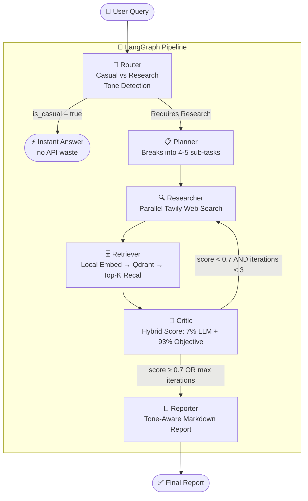

<div align="center">

  

  <br/>

  <h1>🤖 Multi-Agent Research Assistant</h1>

  <p><strong>An autonomous, self-correcting AI pipeline that researches any topic, evaluates its own findings, and writes polished reports — powered by LangGraph.</strong></p>

  <br/>

  <!-- Badges -->


<br/><br/>

🔗 **[Live Demo →](https://multi-agent-research-assistant.onrender.com)**

[**📖 How It Works**](#️-architecture--workflow) · [**🚀 Quickstart**](#-quickstart) · [**💡 Features**](#-features) · [**📄 Sample Output**](#-sample-output)

</div>

---

## 💡 Features

<table>
  <tr>
    <td>🔀 <strong>Smart Router</strong></td>
    <td>Intercepts casual queries (e.g., "Hello!") and answers instantly — no wasted API calls. Detects the desired response tone from your query. Powered by <code>gemini-flash-lite-latest</code>.</td>
  </tr>
  <tr>
    <td>📋 <strong>Intelligent Planner</strong></td>
    <td>Classifies your query into 10 research intent types and breaks it into 4–5 targeted sub-tasks for maximum coverage. Powered by <code>gemini-2.5-flash</code>.</td>
  </tr>
  <tr>
    <td>⚡ <strong>Parallel Research</strong></td>
    <td>Fires concurrent Tavily web searches (up to 5 results per sub-task) using <code>ThreadPoolExecutor</code>. Includes a two-pass LLM pipeline: polish raw findings, then verify against original sources.</td>
  </tr>
  <tr>
    <td>🧠 <strong>Semantic RAG</strong></td>
    <td>Embeds all results with local SentenceTransformers (<code>all-MiniLM-L6-v2</code>, 384-dim) and retrieves only the most relevant chunks via Qdrant — no bloated prompts and zero API embedding costs.</td>
  </tr>
  <tr>
    <td>🔁 <strong>Self-Correcting Loop</strong></td>
    <td>A Critic agent scores research quality using a <strong>hybrid score</strong> (7% LLM + 93% objective signals). If confidence is below <strong>0.7</strong>, it loops back for another research pass — automatically (up to 3 iterations).</td>
  </tr>
  <tr>
    <td>🎭 <strong>Dynamic Tone</strong></td>
    <td>Write "explain like I'm 5" or "be super formal" — the Reporter picks it up from your query and adapts the entire final report.</td>
  </tr>
  <tr>
    <td>🛡️ <strong>Production-Grade Reliability</strong></td>
    <td>Exponential-backoff retries (multiplier=2, 2–10s) on all LLM/API calls. Qdrant connectivity is verified at startup — if unreachable the app fails loudly rather than silently degrading. The LangGraph pipeline is compiled once at startup, not per-request.</td>
  </tr>
  <tr>
    <td>💾 <strong>Intelligent Caching</strong></td>
    <td>Repeated queries are served instantly from cache, bypassing API calls entirely and saving costs.</td>
  </tr>
  <tr>
    <td>🙋 <strong>Doubt Box (Follow-ups)</strong></td>
    <td>Ask specific questions about a generated report. The system first checks the report; if the report doesn't cover the question, it acknowledges this and answers using general knowledge.</td>
  </tr>
  <tr>
    <td>⏸️ <strong>Human-in-the-Loop (HitL)</strong></td>
    <td>Execution pauses before the final report is generated, allowing the user to review intermediate research and approve via the frontend or API. Powered by LangGraph's <code>AsyncSqliteSaver</code> checkpointer.</td>
  </tr>
</table>

---

## 📊 Research Quality Scoring Rubric

Every research run is evaluated by a **hybrid scoring system** (7% LLM judgment + 93% objective signals). The objective score is composed of 6 deterministic signals:

| Signal | Weight | How It Works |
|---|---|---|
| **Retrieval Relevance** | 35% | Average Qdrant cosine similarity between the query embedding and each retrieved chunk. The most reliable signal — directly measures query-document match. |
| **Plan Coverage** | 20% | For each planned sub-task, checks if at least one result addresses it via keyword overlap. Penalizes skipped sub-tasks. |
| **Content Depth** | 20% | Character length as a proxy for substance. `<150 chars` → 0.2 (shallow), `150–500` → 0.7, `>500` → 1.0 (deep). |
| **Source Quality** | 10% | Domain credibility heuristic. `.edu/.gov/.org` → 1.0, known publications (Nature, arXiv, Reuters, etc.) → 0.9, unknown domains → 0.6, missing URL → 0.4. |
| **Duplicate Penalty** | 10% | 80-character fingerprint match detection. Identical fingerprints are penalized. Score = `1.0 - (duplicates / total)`. |
| **Diversity** | 5% | Uniqueness of the first 50 characters across all results. Catches scraping loops that return near-identical content. |

**Composite Formula:**
```
objective_score = (retrieval_relevance × 0.35) + (plan_coverage × 0.20) + (content_depth × 0.20)
               + (source_quality × 0.10) + (duplicate_penalty × 0.10) + (diversity × 0.05)

hybrid_score   = (llm_score × 0.07) + (objective_score × 0.93)
```

> **Threshold:** A hybrid score of **≥ 0.7** is required to break the self-correction loop. If not met after 3 iterations, the pipeline proceeds with grounding safeguards.

---

## 🐛 Bugs Found & Fixed

During development and load testing, we discovered and resolved several critical architectural flaws:

1. **Qdrant Connection Isolation:** The Qdrant client was being instantiated per-request rather than globally. This caused file descriptor leaks and connection timeouts. We moved to a global singleton with startup verification.
2. **Silent Fallback Logic:** The fallback `plain_llm` model was silently overriding genuine network errors, making it look like the multi-agent pipeline succeeded when it actually failed. We exposed clear error states.
3. **Per-Request Graph Rebuild:** LangGraph's `StateGraph` was being recompiled on every single request. Compiling the graph is expensive; we now compile it once at startup and reuse the instance.
4. **API Rate-Limiting & Costs:** Initial external API calls were hitting rate limits (`429 Too Many Requests`). We implemented a batching mechanism with `Tenacity` exponential backoff, and completely migrated off Gemini for embeddings to a local `SentenceTransformer` to remove embedding API quota limits entirely.

## 🏗️ Architecture & Workflow


```mermaid
flowchart TD
    A([🧑 User Query]) --> B

    subgraph Pipeline ["🔄 LangGraph Pipeline"]
        B[🔀 Router\nCasual vs Research\nTone Detection]
        B -- is_casual = true --> Z1([⚡ Instant Answer\nno API waste])
        B -- Requires Research --> C[📋 Planner\nBreaks into 4-5 sub-tasks]
        C --> D[🔍 Researcher\nParallel Tavily Web Search]
        D --> E[🗄️ Retriever\nLocal Embed → Qdrant → Top-K Recall]
        E --> F[🧐 Critic\nHybrid Score: 7% LLM + 93% Objective]
        F -- score < 0.7 AND iterations < 3 --> D
        F -- score ≥ 0.7 OR max iterations --> G[📝 Reporter\nTone-Aware Markdown Report]
    end

    G --> Z2([✅ Final Report])
```

---

## 🛠️ Tech Stack

| Layer               | Technology                                             | Purpose                                                                            |
| ------------------- | ------------------------------------------------------ | ---------------------------------------------------------------------------------- |
| **Orchestration**   | [LangGraph](https://github.com/langchain-ai/langgraph) | Stateful agent graph with conditional edges and checkpointing (`AsyncSqliteSaver`) |
| **Router LLM**      | [Google Gemini](https://ai.google.dev) · `gemini-flash-lite-latest` | Lightweight, fast routing and tone detection                                       |
| **Planner LLM**     | [Google Gemini](https://ai.google.dev) · `gemini-2.5-flash` | Task decomposition into 4-5 research sub-tasks                                    |
| **Researcher LLM**  | [Groq](https://groq.com) · `openai/gpt-oss-20b`       | Research polishing and verification                                                |
| **Critic LLM**      | [Groq](https://groq.com) · `openai/gpt-oss-20b`       | Quality evaluation and hybrid scoring                                              |
| **Reporter LLM**    | [Groq](https://groq.com) · `openai/gpt-oss-120b`      | Tone-aware final report generation and streaming                                   |
| **Doubt LLM**       | [Groq](https://groq.com) · `openai/gpt-oss-120b`      | Follow-up question answering                                                       |
| **Web Search**      | [Tavily API](https://tavily.com) (Advanced Depth, 5 results/task) | Real-time web research                                                 |
| **Embeddings**      | SentenceTransformers · `all-MiniLM-L6-v2`              | 384-dimensional local semantic vectors (zero API cost)                             |
| **Vector Database** | [Qdrant Cloud](https://qdrant.tech)                    | Cosine-similarity retrieval with session + user filtering                          |
| **Backend**         | [FastAPI](https://fastapi.tiangolo.com) + SSE           | Real-time agent progress streaming to frontend                                     |
| **Frontend**        | Vanilla HTML/CSS/JS                                    | "Mission Control" UI with live pipeline visualization                              |
| **Retry Logic**     | [Tenacity](https://tenacity.readthedocs.io)            | Exponential backoff (multiplier=2, 2–10s) on all external calls                    |
| **Concurrency**     | Python `ThreadPoolExecutor`                            | Parallel research sub-tasks                                                        |
| **Deployment**      | [Render](https://render.com)                           | Auto-deploy with health checks                                                     |

---

## 📄 Sample Output

<details>
<summary><strong>🖥️ Click to expand — "AWS vs GCP for Startups in 2025?"</strong></summary>

> **Query:** `"Should a startup build on AWS vs GCP in 2025? Explain the tradeoffs like a senior engineer would."`
> **Tone detected:** `senior software engineer — precise, technical, no hand-holding` | **Iterations:** 2 | **Confidence:** `0.84`

---

### AWS vs GCP for Startups in 2025: A Senior Engineer's Breakdown

The honest answer? **It depends on your workload** — but the decision is far less symmetric than AWS's market dominance implies.

| Criteria             | AWS                 | GCP                      |
| -------------------- | ------------------- | ------------------------ |
| Market share         | ✅ 31% dominant     | ❌ 12%                   |
| ML/AI native tooling | SageMaker (verbose) | ✅ Vertex AI + TPUs      |
| Managed Kubernetes   | EKS (complex)       | ✅ GKE (superior)        |
| Data warehouse       | Redshift            | ✅ BigQuery (serverless) |
| Startup credits      | $5K–$100K           | $200K                    |
| Networking cost      | Expensive egress    | ✅ Cheaper               |

**Choose AWS** → General SaaS, compliance-heavy industries, large hiring pool.
**Choose GCP** → ML-core products, data pipelines, Kubernetes-heavy architectures.

> _The senior engineer's take: AWS is the safe default. GCP is the smart choice if data or ML is core to your product._

</details>

---

## 🚀 Quickstart

### Prerequisites

- Python 3.11+
- Free API accounts (all have generous free tiers):
  - [Groq](https://console.groq.com) — LLM inference (Researcher, Critic, Reporter, Doubt)
  - [Google AI Studio](https://aistudio.google.com) — Gemini models (Router, Planner)
  - [Tavily](https://app.tavily.com) — Web search
  - [Qdrant Cloud](https://cloud.qdrant.io) — Vector database

### Installation

```bash
# 1. Clone the repo
git clone https://github.com/HariChandran7177/multi-agent-research-assistant.git
cd multi-agent-research-assistant

# 2. Create a virtual environment
python -m venv .venv
.venv\Scripts\activate          # Windows
# source .venv/bin/activate     # macOS / Linux

# 3. Install dependencies
pip install -r requirements.txt

# 4. Configure API keys
cp .env.example .env
# Open .env and fill in your keys
```

### Configure `.env`

```env
GROQ_API_KEY=your_groq_key          # https://console.groq.com
GOOGLE_API_KEY=your_gemini_key      # https://aistudio.google.com
TAVILY_API_KEY=your_tavily_key      # https://app.tavily.com
QDRANT_URL=your_qdrant_url          # https://cloud.qdrant.io (or http://localhost:6333)
QDRANT_API_KEY=your_qdrant_key
```

### Run (CLI)

```bash
# Research any topic
python main.py "What are the key tradeoffs of microservices vs monolith architecture?"

# Tone detection — the report will adapt!
python main.py "Explain how transformer attention works like I'm 5 years old"
python main.py "Write a professional brief on the current state of AI regulation"
```

### Run (Web UI)

```bash
# Start the FastAPI server
uvicorn api.research_api:app --host 0.0.0.0 --port 8000

# Open http://localhost:8000 in your browser
```

**Expected output (in ~30–60 seconds):**

```
Researching: What are the key tradeoffs of microservices vs monolith?

Running pipeline... (this may take 30-60 seconds)

==================================================
FINAL REPORT
==================================================

## Microservices vs Monolith: The Honest Engineering Tradeoff
...
```

---

## 📂 Project Structure

```text
multi-agent-research-assistant/
├── agents/
│   ├── router.py        # 🔀 Gatekeeper: casual vs research, tone detection (Gemini)
│   ├── planner.py       # 📋 Breaks complex queries into 4-5 research sub-tasks (Gemini)
│   ├── researcher.py    # 🔍 Parallel Tavily web search + polish + verify (Groq)
│   ├── retriever.py     # 🗄️ Local Embeddings (SentenceTransformer) + Qdrant retrieval
│   ├── critic.py        # 🧐 Hybrid quality scorer: 7% LLM + 93% objective (Groq)
│   ├── reporter.py      # 📝 Tone-aware markdown report writer with streaming (Groq)
│   └── doubt.py         # 🙋 Follow-up question answering on generated reports (Groq)
├── core/
│   ├── cache.py         # Caching mechanism for API cost savings
│   ├── config.py        # Environment variables and all configuration constants
│   ├── graph.py         # LangGraph nodes, edges & conditional routing (AsyncSqliteSaver)
│   ├── health.py        # System health checks and Qdrant startup verification
│   ├── logger.py        # Structured console logging
│   ├── metrics.py       # Observability: token tracking, cost estimation, agent timing
│   ├── report_history.py # SQLite database for archiving past reports
│   ├── scorer.py        # Objective scoring signals (Qdrant, length, sources, diversity)
│   └── state.py         # ResearchState TypedDict — shared agent memory
├── api/
│   ├── main.py          # Minimal FastAPI health check (legacy)
│   └── research_api.py  # Full FastAPI backend with SSE streaming & HITL
├── web/
│   ├── index.html       # "NeuralDesk — Mission Control" frontend
│   ├── style.css        # Dark-mode glassmorphism UI styling
│   └── app.js           # SSE client, pipeline visualization, markdown parser
├── assets/banner.png    # Repo banner
├── main.py              # CLI entry point with follow-up doubt loop
├── .env.example         # API key template
├── requirements.txt     # Python dependencies
├── render.yaml          # Render.com deployment config
├── Dockerfile           # Container deployment
└── LICENSE              # MIT License
```

---

## 🔮 Roadmap & Completed Milestones

### Completed

- [x] **FastAPI + SSE streaming** — Real-time agent progress streamed to the browser
- [x] **Web UI** — Live frontend with per-agent status cards and confidence meters
- [x] **Production hardening** — Qdrant startup check, single graph compilation, longer retry backoff
- [x] **Human-in-the-loop** — Pause the loop and let the user steer research direction via `AsyncSqliteSaver` checkpointer.
- [x] **Caching mechanism** — Query caching to bypass API calls on repeated questions.
- [x] **Doubt resolution** — Follow-up answers on generated reports (report-first, then general knowledge).

### Future Work

- [ ] **LangSmith tracing** — Full observability into every agent step
- [ ] **OpenAI / Anthropic support** — Swap LLM backends via config
- [ ] **Export to PDF** — One-click export of final reports

---

## 🤝 Contributing

Contributions are welcome!

1. Fork the repo
2. Create a branch: `git checkout -b feature/your-feature`
3. Commit your changes: `git commit -m "feat: add your feature"`
4. Push: `git push origin feature/your-feature`
5. Open a Pull Request

---

## 📜 License

This project is licensed under the [MIT License](LICENSE).

---

<div align="center">
  <p>Built with ❤️ by <a href="https://github.com/HariChandran7177">Grandhi Hari Chandran</a></p>
  <p>If this project helped you, please consider giving it a ⭐</p>
</div>
