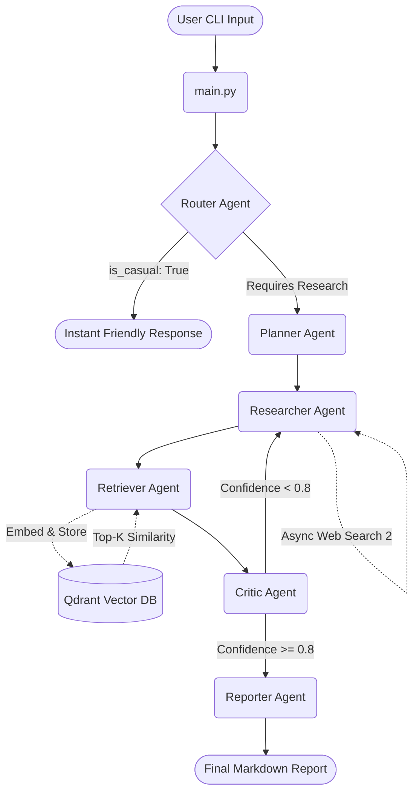

<div align="center">
  <h1>🚀 Multi-Agent Research Assistant</h1>
  <p>An intelligent, production-ready AI orchestration system built with <strong>LangGraph</strong> that plans, researches, evaluates, and writes.</p>
</div>

---

## 🌟 Overview

The Multi-Agent Research Assistant takes a single natural-language query and autonomously coordinates **6 specialized AI agents** to generate comprehensive, fact-checked markdown reports.

What makes this system unique is its focus on **performance and cost-optimization**:
- **Smart Routing**: Simple queries instantly bypass the research pipeline to save tokens.
- **Async Execution**: Deep research tasks are parallelized, reducing 60-second waits to under 10 seconds.
- **Semantic RAG**: Instead of injecting raw HTML into the final prompt, it embeds the web data and retrieves only the most mathematically relevant chunks using Qdrant.
- **Dynamic Tone**: The AI automatically detects the desired tone of your prompt (e.g. "academic", "funny") and customizes the final report.

## 🏗️ Architecture & Workflow


```mermaid
graph TD
    User([User CLI Input]) --> Main(main.py)
    Main --> Router{Router Agent}
    
    Router -- is_casual: True --> CasualResp([Instant Friendly Response])
    Router -- Requires Research --> Planner(Planner Agent)
    
    Planner --> Researcher(Researcher Agent)
    Researcher -.-> |Async Web Search 1| Researcher
    Researcher -.-> |Async Web Search 2| Researcher
    
    Researcher --> Retriever(Retriever Agent)
    Retriever -.-> |Embed & Store| Qdrant[(Qdrant Vector DB)]
    Qdrant -.-> |Top-K Similarity| Retriever
    
    Retriever --> Critic(Critic Agent)
    Critic --> |Confidence < 0.8| Researcher
    Critic --> |Confidence >= 0.8| Reporter(Reporter Agent)
    
    Reporter --> Output([Final Markdown Report])
```

## 🛠️ Tech Stack

| Layer | Technology |
|---|---|
| **Orchestration** | LangGraph + LangChain |
| **LLM Engine** | Groq (`llama-3.3-70b-versatile`) |
| **Web Search** | Tavily API (Advanced Depth) |
| **Embeddings** | Google Gemini (`gemini-embedding-001`, 3072-dim) |
| **Vector Database** | Qdrant Cloud (with fallback to in-memory) |
| **Concurrency** | Python `ThreadPoolExecutor` |

## 📂 Project Structure

```text
├── agents/
│   ├── router.py       # Gatekeeper: intercepts casual chats vs deep research
│   ├── planner.py      # Brain: breaks complex tasks into 5 tactical sub-tasks
│   ├── researcher.py   # Async Workers: scrapes the web concurrently
│   ├── retriever.py    # RAG Engine: handles embeddings and Qdrant retrieval
│   ├── critic.py       # Evaluator: scores research quality out of 1.0
│   └── reporter.py     # Writer: formats the final dynamic markdown report
├── core/
│   ├── graph.py        # LangGraph nodes and conditional edges
│   ├── state.py        # TypedDict shared memory (ResearchState)
│   └── logger.py       # Standardized console logging
├── main.py             # CLI Entry Point
└── requirements.txt
```

## 🚀 Quickstart

1. **Clone & Setup Environment**
   ```bash
   git clone <your-repo-url>
   cd multi-agent-research-assistant
   python -m venv venv
   venv\Scripts\activate          # Windows
   ```

2. **Install Dependencies**
   ```bash
   pip install -r requirements.txt
   ```

3. **Configure API Keys**
   Copy `.env.example` to `.env` and add your keys (all have generous free tiers):
   ```env
   GROQ_API_KEY=your_key
   TAVILY_API_KEY=your_key
   GOOGLE_API_KEY=your_key
   QDRANT_URL=your_url
   QDRANT_API_KEY=your_key
   ```

4. **Run the Assistant**
   ```bash
   python main.py "Explain quantum computing like I'm 5 years old"
   ```

## 🛡️ Fault Tolerance & Safety
- **Retry Logic**: All LLM calls are wrapped in `tenacity` exponential backoffs.
- **Database Fallbacks**: If the remote Qdrant cloud goes down, the Retriever automatically spins up an in-memory database to prevent a hard crash.
- **Cost Caps**: The reflection loop between the Critic and Researcher is strictly capped at 3 iterations to prevent infinite API billing loops.