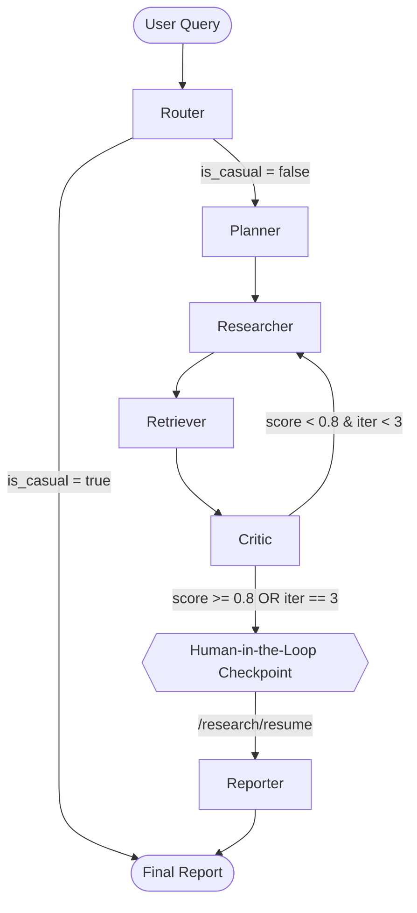

# Project Documentation: Multi-Agent Research Assistant

A complex, LangGraph-orchestrated AI research pipeline featuring parallel web searching, vector-based semantic retrieval, hybrid objective scoring, and Human-in-the-Loop (HitL) execution.

## 1. System Architecture



## 2. Agent Breakdown & Failure Behaviors

| Agent | Input State | Output State | Model/API | Failure Behavior (Code Reality) |
|---|---|---|---|---|
| **Router** | `query` | `is_casual`, `tone` | `groq/compound-mini` | Caught by `asyncio.TimeoutError` or general Exception. Defaults to `is_casual=False` and uses a hardcoded regex keyword heuristic `_detect_tone_heuristic` for tone. Pipeline continues. |
| **Planner** | `query` | `plan`, `iteration_count=0` | `GROQ_MODEL` (`openai/gpt-oss-20b`) | Caught by Exception/Timeout. Defaults `plan` to just `[query]`. Pipeline continues. |
| **Researcher** | `plan` | `research_results` | Tavily API | Uses `ThreadPoolExecutor`. If Tavily times out or rate limits, the specific thread catches the error and silently returns `[]`. No fallback provider exists. |
| **Retriever** | `research_results` | `retrieved_docs`, `qdrant_scores`, `retrieval_available` | SentenceTransformers (`all-MiniLM-L6-v2`), Qdrant | Embeddings and upserts are wrapped in timeouts. If any fail, it calls `_fallback_retrieval`, returning `[]` for docs and scores, setting `retrieval_available=False`. Pipeline continues. |
| **Critic** | `research_results`, `retrieved_docs`, `qdrant_scores` | `confidence_score`, `score_breakdown`, `critique`, `iteration_count += 1` | `openai/gpt-oss-20b` + `core/scorer.py` | If LLM fails or times out, forces `confidence_score = 0.0`, uses the objective score, increments iterations, and logs error. Pipeline continues loop logic. |
| **Reporter** | `plan`, `research_results`, `retrieved_docs`, `tone` | `final_report` | `GROQ_REPORTER_MODEL` (`openai/gpt-oss-20b`) | Three-tier grounding safeguard: (1) if no research data at all (`not has_research`), returns an honest "limited research available" fallback without calling the LLM; (2) if `confidence_score < 0.5`, appends a strict-grounding instruction (`LOW_CONFIDENCE_APPENDIX`) to the prompt forcing the LLM to only use provided data; (3) if LLM fails/timeouts, injects a hardcoded markdown error message alongside raw research text. |
| **Doubt** | `report_text`, `question` | `answer` (string) | `GROQ_REPORTER_MODEL` (`openai/gpt-oss-20b`) | Standalone endpoint (not in graph). Returns string error message to user if timed out/failed. |

## 3. State Schema (`core/state.py`)

The pipeline memory is passed sequentially between nodes as a `TypedDict`.

```python
class ResearchState(TypedDict, total=False):
    query: str                      # The original user question
    user_id: str                    # Used by Retriever as a Qdrant Payload filter for multi-tenant isolation
    is_casual: bool                 # Flag from Router to bypass research for greetings/simple chat
    tone: str                       # Strict styling instruction for the Reporter (e.g. "ELI5", "academic")
    plan: List[str]                 # 4-5 focused sub-tasks generated by Planner
    research_results: List[str]     # Raw markdown scraped via Tavily search
    retrieved_docs: List[str]       # Top 5 most semantically relevant chunks pulled from Qdrant
    qdrant_scores: List[float]      # Raw cosine similarity scores from Qdrant used by Critic
    retrieval_available: bool       # Flag indicating if Qdrant succeeded or failed (fallback used)
    critique: str                   # LLM's text feedback on the current research draft
    confidence_score: float         # 0.0 to 1.0 hybrid score controlling the loop
    score_breakdown: Dict[str, Any] # Debug dict showing exact breakdown of the 6 objective signals
    iteration_count: int            # Prevents infinite loops (caps at MAX_ITERATIONS = 3)
    final_report: str               # The final markdown content generated by the Reporter
```

## 4. Critic Scoring Formula (`core/scorer.py`)

The pipeline's looping mechanism is governed by a strict hybrid formula heavily weighted towards deterministic signals.

**Formula:**
`Hybrid Score = (llm_score * 0.07) + (objective_score * 0.93)`

**Objective Score Breakdown:**
```
objective_score = 
  (calculate_retrieval_relevance(qdrant_scores) * 0.35) +  # Avg Qdrant cosine similarity
  (calculate_plan_coverage(plan, research)      * 0.20) +  # % of plan tasks addressed
  (calculate_depth_score(research)              * 0.20) +  # Penalty for <150 chars, reward >500
  (calculate_source_quality(research)           * 0.10) +  # Reward .edu/.gov/trusted domains
  (calculate_duplicate_penalty(research)        * 0.10) +  # Fingerprint uniqueness penalty
  (calculate_diversity_score(research)          * 0.05)    # Opening 50-char uniqueness
```
*Threshold:* A total hybrid score of **0.8** is required to break the loop early.

## 5. Known Issues & Limitations

1. **No Fallback Search Provider:** If the Tavily API fails, the `Researcher` agent swallows the error and returns zero results. This causes the loop to run empty until `MAX_ITERATIONS` is hit. When this happens, the Reporter's grounding safeguard returns an honest "limited research available" message.
2. **Reporter Hallucination Risk (Mitigated):** The `should_loop` function forces execution to the Reporter when `iteration_count == 3` even if `confidence_score` is low. This is now fully mitigated by two safeguards in `agents/reporter.py`: (1) `_no_research_fallback` skips the LLM call entirely when no research data exists, and (2) `LOW_CONFIDENCE_APPENDIX` forces strict grounding when `confidence_score < 0.5`.
3. **CLI Bypasses Human-in-the-Loop:** In `api/research_api.py`, the stream halts and waits on an `asyncio.Event` for the user to approve the report. However, in `main.py` (the CLI), the code immediately calls `graph.ainvoke(None, config)` following the initial run. This means the CLI completely ignores the HitL pause and forces report generation automatically.
4. **Qdrant `user_id` Index Error:** If a Qdrant collection is created *before* the `user_id` payload index logic was added to `retriever.py`, Qdrant will throw a `400 Bad Request: Index required but not found for "user_id"` on all subsequent searches.

## 6. API Routes (`api/research_api.py`)

| Method | Endpoint | Description |
|---|---|---|
| `GET` | `/health` | Validates API keys and tests Qdrant connection. |
| `GET` | `/health/metrics` | Returns token usage and timing metrics across all agents. |
| `POST`| `/research/stream` | Starts pipeline and streams raw agent states/logs via Server-Sent Events (SSE). |
| `POST`| `/research/resume` | Takes a `thread_id` to release the HitL pause lock, triggering the Reporter. |
| `POST`| `/research` | Synchronous fallback; blocks until pipeline finishes completely. |
| `POST`| `/doubt` | Takes a report and a question; uses `openai/gpt-oss-20b` to answer based strictly on the text. |
| `GET` | `/reports` | Fetches history from local `report_history.sqlite`. |
| `GET` | `/reports/{id}/export.pdf`| Converts markdown to HTML and exports as PDF using Weasyprint. |

## 7. Environment Setup

Required `.env` variables mapped exactly to the codebase logic:
```bash
# LLM Routing & Critic
GROQ_API_KEY=your_key_here

# Web Scraping (Required for researcher.py)
TAVILY_API_KEY=your_key_here

# Semantic Retrieval (Local embeddings used, no API required)
QDRANT_URL=your_remote_qdrant_url
QDRANT_API_KEY=your_qdrant_api_key
```
